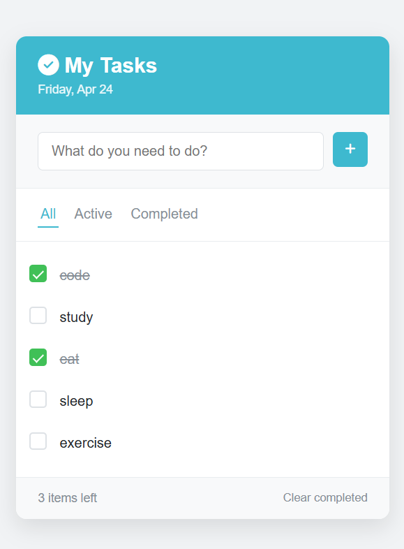

# 📱 To-Do App

A simple and responsive to-do list application built using HTML, CSS, and JavaScript.  
Designed with a mobile-first approach to provide a smooth experience on phones and smaller devices.

---

## 🚀 Features
- ✅ Add new tasks
- 🗑️ Delete tasks
- ✔️ Mark tasks as completed
- 📱 Responsive design (mobile-friendly)

---

## 🛠️ Technologies Used
- HTML
- CSS
- JavaScript

---

## 🌍 Live Demo
👉 https://nahor-dev.github.io/To-Do-app/

---

## 📸 Screenshot

---

## 📌 About
This project was built as part of my learning journey in web development.  
It focuses on building responsive user interfaces and working with core web technologies.

---

## 🔧 Future Improvements
- ✏️ Edit tasks
- 🌙 Dark mode
- 💾 Save tasks using local storage

---

## 📬 Contact
Feel free to connect or give feedback!
